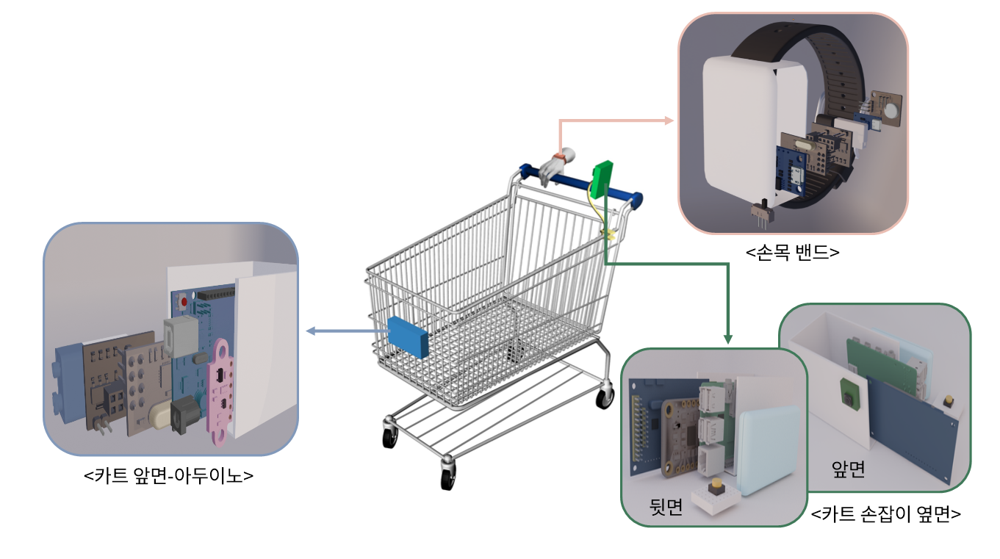

---
# 🛒 시각장애인을 위한 탈부착형 쇼핑카트 보조 모듈
vcc팀

---
# 📝 프로젝트 개요
 쇼핑은 일상에서 빠질 수 없는 활동이지만, 시각장애인에게는 이런 일상생활 속에도 어려움과 불편함이 있음을 인식함. **기존 쇼핑카트에 탈부착 가능한 보조 모듈**을 제공함으로써, 시각장애인이 타인의 도움 없이 **독립적으로 쇼핑을 수행**할 수 있도록 지원하는 제품 개발을 목적으로 함.

---

# 전체 구조


# 🎯 주요 기능
1. ### 🏷️ 상품 및 유통기한 식별
---
카메라에 상품을 인식하면 AI 학습을 통해 제품명을 알려주고 실시간으로 유통기한을 판독하고 상품과 관련한 DB를 통해 사용자에게 제품명, 가격, 유통기한 제공. 필요에 따라 제품에 관한 상세정보도 제공. 동일 카테고리내에서 제품 구별.

   - 라벨링 된 이미지를 이용하여 AI 학습. (Roboflow, Google colab 이용)
   - **YOLOv8 모델**을 통해 상품을 인식.  
   - **OCR 기술(Pytesseract)**을 활용해 유통기한을 판독하고, **gTTS 음성 안내**로 사용자에게 정보를 제공합.
   - 상품 인식 후 **데이터베이스**에서 가격, 칼로리, 영양 성분 등 정보를 조회하여 **음성으로 출력**.

---
<details>
<summary>👉 상품 인식 기능 세부 내용(코드)</summary>

상품 인식 파일, 유통기한 추출 파일, DB 파일 모듈화, main파일에서 스크립트 호출
<br>
<details>
<summary> 상품 인식 파일 코드 </summary>

```python
from picamera2 import Picamera2
import cv2
import os
from gtts import gTTS
import uuid
import subprocess
from ultralytics import YOLO

def speak(text):
    filename = f"/tmp/tts_{uuid.uuid4()}.mp3"
    tts = gTTS(text=text, lang='ko')
    tts.save(filename)
    subprocess.call(f'mpg123 "{filename}"', shell=True)
    os.remove(filename)

speak("상품을 카메라 앞에 나둬주세요.")

model = YOLO("학습 파일 경로")

output_path = "결과 파일 경로"
os.makedirs(output_path, exist_ok=True)

cam = Picamera2()
cam.configure(
    cam.create_video_configuration(
        main={"format": "XRGB8888", "size": (320, 240)}
    )
)
cam.start()

label_to_kor = {
    "shinramen": "신라면",
    "jinramyun": "진라면",
    "nuguri": "너구리",
    "jjapagetti": "짜파게티",
    "buldakbokkeummyun": "불닭볶음면"
}

print("인식모드 시작")

while True:
    frame = cam.capture_array()
    frame = cv2.cvtColor(frame, cv2.COLOR_RGBA2RGB)

    results = model(frame)
    boxes = results[0].boxes

    if len(boxes) > 0:
        cls = int(boxes.cls[0])
        label = model.names[cls]

        kor = label_to_kor.get(label)
        if kor:
            with open(os.path.join(output_path, "ramen.txt"), "w") as f:
                f.write(label)

            print(f"제품 인식됨: {kor}")
            break

    cv2.waitKey(1)

cam.stop()
cv2.destroyAllWindows()
```
</details>

<details>
<summary> 유통기한 추출 파일 코드 </summary>
   
```python
from picamera2 import Picamera2
import pytesseract
import cv2
import re
import os
import time
from gtts import gTTS
import uuid
import subprocess


output_path = "/home/see2407me/result/"
os.makedirs(output_path, exist_ok=True)

def speak(text):
    filename = f"/tmp/tts_{uuid.uuid4()}.mp3"
    tts = gTTS(text=text, lang='ko')
    tts.save(filename)
    subprocess.call(f'mpg123 "{filename}"', shell=True)
    os.remove(filename)

def extract_date(text):
    m = re.search(r"\d{4}\.\d{2}\.\d{2}", text)
    if m:
        return m.group()
    return None

speak("유통기한 인식을 위해 상품을 돌려주세요.")

cam = Picamera2()
cam.configure(cam.create_video_configuration(main={"format":"XRGB8888","size":(640,480)}))
cam.start()
time.sleep(1)

print("자동 인식 모드 시작")

frame_count = 0
max_attempts = 100

while True:
    frame = cam.capture_array()
    frame = cv2.cvtColor(frame, cv2.COLOR_RGBA2RGB)
    cv2.imshow("OCR", frame)

    frame_count += 1
    if frame_count % 8 != 0:
        if cv2.waitKey(1) == ord('q'):
            break
        continue

    print("시도중...")
    text = pytesseract.image_to_string(frame, lang='kor+eng')
    expiry = extract_date(text)

    if expiry:
        with open(output_path + "expiry.txt", "w") as f:
            f.write(expiry)

        print("유통기한:", expiry)
        break
    else:
        print("유통기한 인식 실패 : 재시도 중”)

    if frame_count > max_attempts:
        speak("유통기한을 찾지 못했습니다. 상품 위치를 조정해주세요.")
        break

    if cv2.waitKey(1) == ord('q'):
        break

cam.stop()
cv2.destroyAllWindows()

```
</details>

</details>

---

2. ### 🚧 실시간 장애물 감지
 #### 장애물이 카트 앞에 위치할 경우 임계거리를 설정하여 임계거리 안으로 들어오면, 손목밴드의 진동을 이용해 사용자에게 알림. 장애물 거리에 따라 진동 속도를 다르게 하여 위험도를 표현.
   - **아두이노 + 거리 센서**를 활용해 전방 장애물 거리 측정.
   - **무선통신모듈**을 통해 장애물에 따른 신호 송수신.
   - **Attiny85 + 진동모듈**을 이용하여 사용자에게 실시간으로 위험도를 알림.

<details>
<summary>👉 장애물 감지 기능 세부 내용(코드)</summary>

  여기에 접히는 내용을 작성합니다.
  여러 줄도 가능하고 마크다운도 쓸 수 있어요.

```python
  print("예시 코드")
```
</details>

***

3. ### 🧭 실내 경로 안내
 #### 사용자의 위치를 인식하여 목적지의 경로를 계산하여 음성으로 경로를 안내함.
   - 매장 내 위치 추적 기능으로 **원하는 상품 코너까지의 경로 안내** 지원 (기본적 내비게이션 알고리즘 또는 Beacon 기반 가능).
  
  <details>
  <summary>👉 경로 안내 기능 세부 사항(코드)</summary>

  여기에 접히는 내용을 작성합니다.
  여러 줄도 가능하고 마크다운도 쓸 수 있어요.

```python
  print("예시 코드")
```
</details>

---

## 🛠 기술 스택

| 분류 | 기술 구성 |
|------|------------|
| **하드웨어** | Raspberry Pi, Arduino, 거리센서, PiCameraV2, 배터리팩 등|
| **소프트웨어** | Python, openCV, YOLOv8, gTTS, DB(데이터베이스) 등 |

## 추가 기능
## 
## 완성 모형
### 시연 영상
## 기대 효과

- **시각장애인의 자율적인 쇼핑 환경 제공**  
- **충돌 방지를 통한 안전성 확보**  
- **사회적 약자 배려 기술로서의 확장성**  
- **다양한 유통 환경에 적용 가능한 범용 모듈**

---
