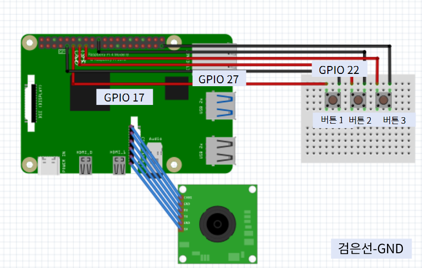
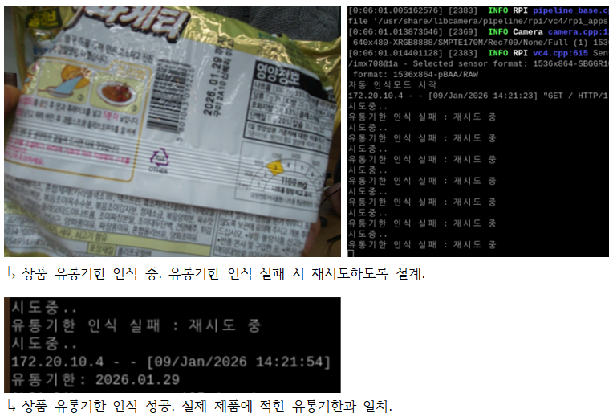
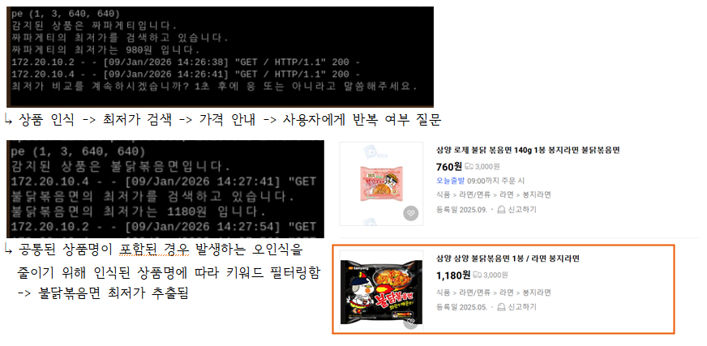
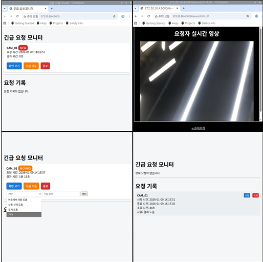

# 💡 시각장애인을 위한 쇼핑카트 보조기기

## ✍️ 프로젝트 개요
 쇼핑은 일상에서 빠질 수 없는 활동이지만, 시각장애인에게는 이런 일상생활 속에도 어려움과 불편함이 있음을 인식함. **기존 쇼핑카트에 탈부착 가능한 보조 모듈**을 제공함으로써, 시각장애인이 타인의 도움 없이 **독립적으로 쇼핑을 수행**할 수 있도록 지원하는 제품 개발을 목적으로 함.

---
## 🛒 전체 구조 설계도


- 카트 옆면 : Raspberry pi 이용 - 카메라, 푸시버튼, usb 사운드 카드, 이어폰, 보조배터리 사용
- 카트 앞면 (송신부) : Arduino uno 이용 - VL53L0X 거리센서, NRF24L01 신호 송신 모듈,NRF24L01 어댑터, AA건전지(4개), 스위치 사용
- 손목 밴드 (수신부): Arduino nano 이용 - NRF24L01 신호 수신 모듈, NRF24L01 어댑터, 진동모터, 리튬이온 배터리, 충전 승압기, 스위치 2개 (진동 및 전원) 

---
## 🎯 주요 기능 (1~4)
### **Raspberry pi + Arduino**를 이용한 기능
 - Raspberry pi를 통해 **상품 인식, 최저가 비교, 도움요청** 기능을 추가
 - Arduino를 이용해 **장애물 감지** 기능을 추가

**Raspberry pi bread board view**

- 버튼 1 - 상품 인식 + 유통기한 인식
- 버튼 2 - 최저가 비교
- 버튼 3 - 도움 요청
- usb 포트에 사운드 카드 연결 + 이어폰 연결 -> 음성인식 가능

**Arduino bread board view**

- 송신부

  
---
1. ### 🏷️ 상품 및 유통기한 식별 - Raspberry pi ( 코드 변한거 넣기.)
    카메라에 상품을 인식하면 **AI 학습**을 통해 제품명을 알려주고 실시간으로 **유통기한을 판독**하고 상품과 관련한 **DB**를 통해 사용자에게 제품명, 가격, 유통기한 제공. 필요에 따라 제품에 관한 상세정보도 제공. 동일 카테고리내에서 제품 구별.
   
   - 라벨링 된 이미지를 이용하여 AI 학습. (Roboflow, Google colab 이용)
   - **YOLOv8 모델**을 통해 상품을 인식.  
   - **OCR 기술**을 활용해 유통기한을 판독하고, **gTTS 음성 안내**로 사용자에게 정보를 제공합.
   - 상품 인식 후 **데이터베이스**에서 가격, 칼로리, 영양 성분 등 정보를 조회하여 **음성으로 출력**.

👉 상품 인식 기능 세부 내용(코드)
  
	- 상품 인식 파일, 유통기한 추출 파일, DB 파일 모듈화, main파일에서 스크립트 호출
	- 상품은 라면을 중심으로 (너구리, 짜파게티, 신라면, 진라면, 불닭볶음면) 코드 작성
	
<details>
	
   <summary> 상품 YOLOv8 인식 관련 코드 </summary>
	
```python
from ultralytics import YOLO
from picamera2 import Picamera2
import cv2
import os
from gtts import gTTS
import uuid
import subprocess

def speak(text):
    filename = f"/tmp/tts_{uuid.uuid4()}.mp3"
    tts = gTTS(text=text, lang='ko')
    tts.save(filename)
    subprocess.call(f'mpg123 "{filename}"', shell=True)
    os.remove(filename)

speak("상품을 카메라 앞에 나둬주세요.")    
model = YOLO("/home/see2407me/ramen.pt")

output_path = "/home/see2407me/result/"
os.makedirs(output_path, exist_ok=True)

cam = Picamera2()
cam.configure(cam.create_video_configuration(main={"format":"XRGB8888","size":(320,240)}))
cam.start()

label_to_kor = {
    "sinlamen": "신라면",
    "jinramyun": "진라면",
    "nuguri": "너구리",
    "jjapagetti": "짜파게티",
    "Firechickenboggummyun": "불닭볶음면"
}

print("라면 인식 모드")

while True:
    frame = cam.capture_array()
    frame = cv2.cvtColor(frame, cv2.COLOR_RGBA2RGB)

    results = model(frame)
    boxes = results[0].boxes

    if len(boxes) > 0:
        cls = int(boxes.cls[0])
        label = model.names[cls]

        kor = label_to_kor.get(label, None)
        if kor:
            with open(output_path + "ramen.txt", "w") as f:
                f.write(label)

            print(f"라면 인식됨: {kor}")
            break
    cv2.waitKey(1)

cam.stop()
cv2.destroyAllWindows()
```
</details>

<details>
   <summary> 유통기한 추출 파일 코드 </summary>
   
```python
from picamera2 import Picamera2
import pytesseract
import cv2
import re
import os
import time
from gtts import gTTS
import uuid
import subprocess


output_path = "/home/see2407me/result/"
os.makedirs(output_path, exist_ok=True)

def speak(text):
    filename = f"/tmp/tts_{uuid.uuid4()}.mp3"
    tts = gTTS(text=text, lang='ko')
    tts.save(filename)
    subprocess.call(f'mpg123 "{filename}"', shell=True)
    os.remove(filename)

def extract_date(text):
    text = text.replace(" ", "").replace("까지", "").replace("유통기한", "").replace("제조", "")
    m = re.search(r"\d{4}\.\d{2}\.\d{2}", text)
    if m:
        return m.group()
    return None

speak("유통기한을 인식하기 위해 상품을 돌려주세요.")

cam = Picamera2()
cam.configure(cam.create_video_configuration(main={"format":"XRGB8888","size":(640,480)}))
cam.start()
time.sleep(1)

print("자동 인식모드 시작")

frame_count = 0
max_attempts = 100

while True:
    frame = cam.capture_array()
    frame = cv2.cvtColor(frame, cv2.COLOR_RGBA2RGB)
    cv2.imshow("OCR", frame)

    frame_count += 1
    if frame_count % 8 != 0:
        if cv2.waitKey(1) == ord('q'):
            break
        continue

    print("시도중..")
    text = pytesseract.image_to_string(frame, lang='kor+eng')
    expiry = extract_date(text)

    if expiry:
        with open(output_path + "expiry.txt", "w") as f:
            f.write(expiry)

        print("유통기한:", expiry)
        break
    else:
        print("유통기한 인식 실패 : 재시도 중")

    if frame_count > max_attempts:
        speak("유통기한을 찾지 못했습니다. 상품 위치를 조정해주세요.")
        frame_count = 0
        continue
       
    if cv2.waitKey(1) == ord('q'):
        break

cam.stop()
cv2.destroyAllWindows()
```
</details>

<details>
   <summary> 음성 및 DB 상세정보 코드 </summary>

```python
# DB만들기

sqlite3 /home/생성할 DB경로

CREATE TABLE ramen_info (
    id INTEGER PRIMARY KEY AUTOINCREMENT,
    name TEXT NOT NULL,
    calories INTEGER,
    sodium INTEGER,
    fat REAL,
    carbohydrate REAL,
    protein REAL
);

INSERT INTO ramen_info (name, calories, sodium, fat, carbohydrate, protein) VALUES
('진라면', 500, 1900, 16, 78, 10),
('신라면', 505, 1890, 17, 80, 9),
('너구리', 510, 1940, 18, 76, 8),
('짜파게티', 600, 1200, 21, 90, 10),
('불닭볶음면', 530, 1600, 20, 85, 11);

.exit  # 나가기

UPDATE ramen_info SET sodium = 1950 WHERE name = '신라면';  # 내용 변경시 명령어
ALTER TABLE ramen_info ADD COLUMN price INTEGER;  # 열 추가 (가격)

SELECT * FROM ramen_info;  # 내용확인
```

```python
import sqlite3
import os
import time
import uuid
import subprocess
import speech_recognition as sr
from gtts import gTTS

r = sr.Recognizer()
mic = sr.Microphone(device_index=1)

def speak(text):
    """텍스트를 TTS로 읽어줌"""
    filename = f"/tmp/tts_{uuid.uuid4()}.mp3"
    tts = gTTS(text=text, lang="ko")
    tts.save(filename)
    subprocess.call(f'mpg123 -q "{filename}"', shell=True)
    os.remove(filename)
    time.sleep(1.0)

def format_expiry(expiry):
    """YYYY.MM.DD -> YYYY년 MM월 DD일"""
    try:
        y, m, d = expiry.split('.')
        return f"{y}년 {m}월 {d}일"
    except:
        return expiry  # 혹시 포맷이 이상하면 그대로 반환

YES_KEYWORDS = ["예", "네", "응", "줘" ,"그래", "해","알려줘"]
NO_KEYWORDS = ["아니", "아니요", "괜찮아", "필요없어", "됐어"]

def recognize_yes_no():
    """음성 인식 후 yes/no/unknown 반환"""
    with mic as source:
        r.adjust_for_ambient_noise(source, duration=0.5)
        try:
            audio = r.listen(source, timeout=5, phrase_time_limit=5)
        except:
            return "unknown"

    try:
        result = r.recognize_google(audio, language="ko-KR")
        print("인식된 음성:", result)
        if any(k in result for k in YES_KEYWORDS):
            return "yes"
        if any(k in result for k in NO_KEYWORDS):
            return "no"
        return "unknown"
    except:
        return "unknown"

label_to_kor = {
    "shinramen": "신라면",
    "jinramyun": "진라면",
    "nuguri": "너구리",
    "jjapagetti": "짜파게티",
    "buldakbokkeummyun": "불닭볶음면"
}

with open("/home/see2407me/result/ramen.txt") as f:
    ramen_label = f.read().strip()

kor_name = label_to_kor.get(ramen_label, ramen_label)

with open("/home/see2407me/result/expiry.txt") as f:
    expiry = f.read().strip()

expiry = format_expiry(expiry)

conn = sqlite3.connect("/home/see2407me/ramen.db")
cursor = conn.cursor()
cursor.execute("SELECT * FROM ramen_info WHERE name=?", (kor_name,))
row = cursor.fetchone()
conn.close()

speak(f"이 제품은 {kor_name}입니다.")

if row:
    _, name, cal, sodium, fat, carb, protein, price = row
    speak(f"가격은 {price}원이고 유통기한은 {expiry}입니다.")

speak("상세 정보를 읽어드릴까요? 1초 후에 응 또는 아니라고 말씀해주세요.")

while True:
    answer = recognize_yes_no()

    if answer == "yes" and row:
        speak(
            f"{name}의 상세 정보입니다. "
            f"열량 {cal}킬로칼로리, "
            f"탄수화물 {carb}그램, "
            f"지방 {fat}그램, "
            f"나트륨 {sodium}밀리그램, "
            f"단백질 {protein}그램 입니다."
        )
        break  # 상세정보 안내 후 루프 종료
    elif answer == "no":
        break  # 상세정보 안내 없이 루프 종료
    else:
        speak("대답을 이해하지 못했습니다. 다시 말씀해 주세요.")

```

</details>

<details>
	
   <summary> 통합 코드 </summary>
	
```python
from gpiozero import Button
import subprocess
import os
import time
import uuid
import speech_recognition as sr
from gtts import gTTS

r = sr.Recognizer()
mic = sr.Microphone(device_index=1)

YES_WORDS = ["예", "네", "응", "그래", "해", "계속"]
NO_WORDS = ["아니", "아니요", "괜찮아", "그만", "종료", "중지"]

def speak(text):
    print(text)
    filename = f"/tmp/tts_{uuid.uuid4()}.mp3"
    tts = gTTS(text=text, lang="ko")
    tts.save(filename)
    subprocess.call(f'mpg123 -q "{filename}"', shell=True)
    os.remove(filename)
    time.sleep(1.0)

def listen_yes_no():
    with mic as source:
        r.adjust_for_ambient_noise(source, duration=0.5)
        try:
            audio = r.listen(source, timeout=5, phrase_time_limit=5)
        except:
            return ""
    try:
        text = r.recognize_google(audio, language="ko-KR")
        print("인식된 음성:", text)
        return text
    except:
        return ""

def run_and_wait(cmd):
    return subprocess.call(cmd, shell=True)

while True:

    run_and_wait("python3 /home/see2407me/d.py")
    run_and_wait("python3 /home/see2407me/2.py")
    run_and_wait("python3 /home/see2407me/tts2.py")

    speak("상품 인식을 계속하시겠습니까? 1초 후에 응 또는 아니라고 말씀해주세요.")

    while True:
        answer = listen_yes_no()

        if any(word in answer for word in YES_WORDS):
            speak("상품 인식을 계속 진행합니다.")
            break
        elif any(word in answer for word in NO_WORDS):
            speak("프로그램을 종료합니다.")
            exit()
        else:
            speak("대답을 이해하지 못했습니다. 다시 말씀해 주세요.")
```
</details>

---
2. ### ➕ 최저가 비교 - Raspberry pi
    상품을 인식하게 되면 그 **상품의 최저가를 네이버 검색**을 통해 검색 후 알려줌.

   - **라즈베리 카메라**를 통해 상품을 인식함.
   - 인식한 상품의 **낱개 가격**을 실시간 음성으로 알려줌.

   [검색 과정]
    ```python      
   - 네이버 Open API 활용하여 온라인 상품 가격 정보를 조회함
   - 라면 1봉 기준 가격 안내이므로, 상품 인식 후 [상품명 + 1봉] 형태로 검색을 수행함
   - 공통된 상품명이 포함된 경우 발생하는 오인식을 줄이기 위해, 인식된 상품명에 따라 
    ```
    
<details>
<summary> 최저가 검색(코드)</summary>

  여기에 접히는 내용을 작성합니다.
  여러 줄도 가능하고 마크다운도 쓸 수 있어요.

```python
  from picamera2 import Picamera2
from ultralytics import YOLO
import cv2
import requests
import os
import time
import uuid
import subprocess
import speech_recognition as sr
from gtts import gTTS

def load_keys():
    with open("naver_key.txt", "r") as f:
        lines = f.read().splitlines()
        return lines[0], lines[1]

CLIENT_ID, CLIENT_SECRET = load_keys()

label_to_kor = {
    "nuguri": "너구리",
    "sinlamen": "신라면",
    "jinramyun": "진라면 매운맛",
    "jjapagetti": "짜파게티",
    "Firechickenboggummyun": "불닭볶음면",
    "_Carbo": "까르보 불닭볶음면",
    "_Rose": "로제 불닭볶음면"
}

BULDAK_EXCLUDE = ["로제", "까르보", "치즈", "탕면", "핵"]
EXCLUDE_KEYWORDS = ["캐릭터", "미니어쳐", "미니어처", "소품", "파츠", "모바일상품권", "모바일쿠폰", "온라인상품권", "온라인쿠폰", "기프티콘", "모형", "피규어", "장난감"]

YES_WORDS = ["예", "에", "네", "응", "그래", "해", "계속", "해줘"]
NO_WORDS = ["아니", "괜찮아", "됐어", "아니오", "그만", "종료", "중지"]

r = sr.Recognizer()
mic = sr.Microphone(device_index=1)

def speak(text):
    print(text)
    filename = f"/tmp/tts_{uuid.uuid4()}.mp3"
    tts = gTTS(text=text, lang="ko")
    tts.save(filename)
    subprocess.call(f'mpg123 -q "{filename}"', shell=True)
    os.remove(filename)
    time.sleep(0.8)

def listen_yes_no():
    with mic as source:
        r.adjust_for_ambient_noise(source, duration=0.4)
        try:
            audio = r.listen(source, timeout=5, phrase_time_limit=5)
        except:
            return ""
    try:
        text = r.recognize_google(audio, language="ko-KR")
        print("인식된 음성:", text)
        return text
    except:
        return ""

def map_label_to_kor(label):
    return label_to_kor.get(label)

def search_lowest_price(query, is_buldak):
    url = "https://openapi.naver.com/v1/search/shop.json"
    headers = {
        "X-Naver-Client-Id": CLIENT_ID,
        "X-Naver-Client-Secret": CLIENT_SECRET
    }
    params = {"query": query, "display": 10, "sort": "asc"}
    res = requests.get(url, headers=headers, params=params)
    items = res.json().get("items", [])
    filtered = []
    for item in items:
        title = item["title"]
        if is_buldak and any(x in title for x in BULDAK_EXCLUDE):
            continue
        if any(x in title for x in EXCLUDE_KEYWORDS):
            continue
        filtered.append(item)
    return filtered[0] if filtered else None

def detect_ramen(model, frame):
    if frame.shape[2] == 4:
        frame = cv2.cvtColor(frame, cv2.COLOR_BGRA2RGB)
    else:
        frame = cv2.cvtColor(frame, cv2.COLOR_BGR2RGB)

    results = model(frame)
    detected_labels = []

    for r_ in results:
        for box in r_.boxes:
            cls_id = int(box.cls[0])
            label = model.names[cls_id]
            if label in label_to_kor:
                detected_labels.append(label)

    for label in detected_labels:
        if "_Carbo" in label or "_Rose" in label:
            return label

    if "Firechickenboggummyun" in detected_labels:
        return "Firechickenboggummyun"

    return detected_labels[0] if detected_labels else None

def run_once(model, picam2):
    while True:
        frame = picam2.capture_array()
        detected = detect_ramen(model, frame)
        if detected:
            break

    kor_name = map_label_to_kor(detected)
    is_buldak = kor_name == "불닭볶음면"
    query = f"{kor_name} 1봉"

    speak(f"감지된 상품은 {kor_name}입니다.")
    speak(f"{kor_name}의 최저가를 검색하고 있습니다.")

    item = search_lowest_price(query, is_buldak)

    if item:
        speak(f"{kor_name}의 최저가는 {item['lprice']}원 입니다.")
    else:
        speak("최저가를 찾지 못했습니다.")

speak("상품을 카메라에 비추어 주세요.")

picam2 = Picamera2()
picam2.configure(picam2.create_preview_configuration(main={"size": (640, 640)}))
picam2.start()

model = YOLO("ramen.pt")

try:
    while True:
        run_once(model, picam2)

        speak("최저가 비교를 계속하시겠습니까? 1초 후에 응 또는 아니라고 말씀해주세요.")

        while True:
            answer_text = listen_yes_no()

            if any(word in answer_text for word in YES_WORDS):
                speak("최저가 비교를 계속 진행하겠습니다. 원하시는 상품을 비춰주세요.")
                break

            if any(word in answer_text for word in NO_WORDS):
                speak("최저가 비교를 종료합니다.")
                raise KeyboardInterrupt

            speak("대답을 이해하지 못했습니다. 다시 말씀해주세요.")
            time.sleep(0.5)

except KeyboardInterrupt:
    pass
finally:
    picam2.stop()
    del picam2
```
</details>

---
3. ### 🚨 도움 요청 안내 - Raspberry pi
    사용자가 도움이 필요할때 버튼을 누르면 **사이트를 통해 알림**을 보냄.

   - 버튼을 통해 **실시간**으로 도움 요청을 확인.
   - **카메라**를 통해 사용자의 위치를 확인.
   - **소요 시간**과 **도움 요청 사유**를 기록할 수 있음.

<details>
<summary>도움 요청 서버,사이트 (코드)</summary>

  여기에 접히는 내용을 작성합니다.
  여러 줄도 가능하고 마크다운도 쓸 수 있어요.

```python
  from flask import Flask, request, redirect, render_template_string, Response
import requests
from datetime import datetime
import time

app = Flask(__name__)

devices = {}
history = []
clients = []

REASONS = [
    "마트에서 이동 도움",
    "상품 선택 도움",
    "결제 도움",
    "카트 넘어짐",
    "오작동",
    "기타"
]

def elapsed_time_str(start_time, end_time=None):
    if end_time is None:
        delta = datetime.now() - start_time
    else:
        delta = end_time - start_time
    s = int(delta.total_seconds())
    if s < 60:
        return f"{s}초"
    elif s < 3600:
        return f"{s//60}분 {s%60}초"
    else:
        return f"{s//3600}시간 {(s%3600)//60}분"

@app.route("/events")
def sse():
    def gen():
        q = []
        clients.append(q)
        try:
            while True:
                if q:
                    msg = q.pop(0)
                    yield f"data: {msg}\n\n"
                else:
                    time.sleep(0.5)
        except GeneratorExit:
            clients.remove(q)
    return Response(gen(), mimetype="text/event-stream")

@app.route("/")
def index():
    return render_template_string("""
<!DOCTYPE html>
<html lang="ko">
<head>
<meta charset="UTF-8">
<title>긴급 요청 모니터</title>
<meta http-equiv="refresh" content="15">
<meta name="viewport" content="width=device-width, initial-scale=1">
<style>
body { font-family: sans-serif; background:#f4f6f8; margin:0; padding:16px; }
h1 { margin-bottom: 10px; }
.card { background:#fff; border-radius:12px; padding:16px; margin-bottom:12px; box-shadow:0 2px 6px rgba(0,0,0,0.1); position:relative; }
.badge-new { color:white; background:#d32f2f; padding:4px 10px; border-radius:12px; }
.badge-move { color:white; background:#f57c00; padding:4px 10px; border-radius:12px; }
.btn { display:inline-block; padding:8px 12px; border-radius:6px; color:white; text-decoration:none; margin-right:6px; }
.view { background:#1976d2; }
.move { background:#f57c00; }
.clear { background:#d32f2f; }
.history { background:#eceff1; padding:10px; margin-bottom:10px; border-radius:10px; position:relative; }
.history .delete, .history .edit-btn { position:absolute; right:10px; top:10px; background:#d32f2f; color:white; border:none; padding:3px 6px; border-radius:4px; cursor:pointer; margin-left:4px;}
.history .edit-btn { background:#1976d2; right:60px; }
form { margin:0; }
select, input[type=text] { margin-top:4px; padding:4px 6px; width:200px; border-radius:4px; border:1px solid #ccc; }
</style>

<script>
const evtSource = new EventSource("/events");
evtSource.onmessage = function(event) {
    location.reload();
};
function showReasonForm(deviceId) {
    document.getElementById('reason-form-' + deviceId).style.display = 'block';
}
function toggleOtherInput(sel) {
    const otherInput = sel.parentNode.querySelector('input[name="other_reason"]');
    if(sel.value == '기타') otherInput.style.display='inline-block';
    else otherInput.style.display='none';
}
function showEditForm(idx) {
    document.getElementById('edit-form-' + idx).style.display = 'block';
}
</script>
</head>
<body>

<h1>긴급 요청 모니터</h1>


<div class="card">
<b>{{ id }}</b>
<span class="{{ 'badge-new' if d.status=='NEW' else 'badge-move' }}">{{ d.status }}</span><br>
요청 시간: {{ d.time_str }}<br>
경과 시간: {{ d.elapsed }}<br>
요청 사유: {{ d.reason }}<br><br>

<a class="btn view" href="/device/{{ id }}">화면 보기</a>
<a class="btn move" href="/move/{{ id }}">직원 이동</a>
<a class="btn clear" href="javascript:void(0)" onclick="showReasonForm('{{ id }}')">종료</a>

<div id="reason-form-{{ id }}" style="display:none; margin-top:8px;">
<form action="/clear/{{ id }}" method="post">
<select name="reason" onchange="toggleOtherInput(this)">

<option value="{{ r }}">{{ r }}</option>

</select>
<input type="text" name="other_reason" placeholder="직접 입력" style="display:none;">
<input type="submit" value="확인">
</form>
</div>
</div>

<p>현재 요청이 없습니다.</p>


<hr>

<h1>요청 기록</h1>

<div class="history">
<b>{{ h.device_id }}</b><br>
시작 시간: {{ h.start_time }}<br>
종료 시간: {{ h.end_time }}<br>
소요 시간: {{ h.duration }}<br>
사유: {{ h.reason }}

<form action="/delete_history/{{ idx }}" method="post" style="display:inline;">
<button class="delete">삭제</button>
</form>

<button class="edit-btn" onclick="showEditForm({{ idx }})">수정</button>

<div id="edit-form-{{ idx }}" style="display:none; margin-top:4px;">
<form action="/edit_reason/{{ idx }}" method="post">
<select name="reason" onchange="toggleOtherInput(this)">

<option value="{{ r }}" selected>{{ r }}</option>

</select>
<input type="text" name="other_reason" value="{{ h.reason }}">
<input type="submit" value="확인">
</form>
</div>

</div>

<p>요청 기록이 없습니다.</p>


</body>
</html>
""",
devices={k: {
    **v,
    "elapsed": elapsed_time_str(v["time"]),
    "time_str": v["time"].strftime("%Y-%m-%d %H:%M:%S")
} for k,v in devices.items()},
history=history,
reasons=REASONS,
enumerate=enumerate
)

@app.route("/device/<device_id>")
def view_device(device_id):
    d = devices.get(device_id)
    if not d:
        return "해당 장치를 찾을 수 없습니다.", 404
    return f"""
<html>
<head><meta charset="UTF-8"></head>
<body style="background:black;color:white;text-align:center">
<h2>{device_id} 요청 화면</h2>
<iframe src="{d['stream_url']}" width="720" height="540"></iframe><br><br>
<a href="/" style="color:white">← 돌아가기</a>
</body>
</html>
"""

@app.route("/emergency", methods=["POST"])
def emergency():
    data = request.get_json(silent=True)
    if not data:
        return "Invalid JSON", 400

    device_id = str(data.get("device_id"))
    stream_url = str(data.get("stream_url"))
    reason = str(data.get("reason", "기타"))

    devices[device_id] = {
        "stream_url": stream_url,
        "status": "NEW",
        "time": datetime.now(),
        "reason": reason
    }
    for q in clients:
        q.append("update")

    return "OK", 200


@app.route("/move/<device_id>")
def move_staff(device_id):
    d = devices.get(device_id)
    if not d:
        return "Not found", 404
    try:
        requests.get(d["stream_url"] + "/staff_moving", timeout=2)
    except:
        pass
    d["status"] = "MOVING"
    return redirect("/")

@app.route("/clear/<device_id>", methods=["POST"])
def clear(device_id):
    d = devices.get(device_id)
    if d:
        try:
            requests.get(d["stream_url"] + "/stop", timeout=1)
        except:
            pass

        reason = request.form.get("reason")
        other_reason = request.form.get("other_reason")

        if reason == "기타" and other_reason.strip():
            reason = other_reason.strip()

        end_time = datetime.now()

        history.insert(0, {
            "device_id": device_id,
            "start_time": d["time"].strftime("%Y-%m-%d %H:%M:%S"),
            "end_time": end_time.strftime("%Y-%m-%d %H:%M:%S"),
            "duration": elapsed_time_str(d["time"], end_time),
            "reason": reason
        })

        devices.pop(device_id, None)

    return redirect("/")

@app.route("/edit_reason/<int:idx>", methods=["POST"])
def edit_reason(idx):
    if 0 <= idx < len(history):
        reason = request.form.get("reason")
        other_reason = request.form.get("other_reason")
        if reason == "기타" and other_reason.strip():
            reason = other_reason.strip()
        history[idx]["reason"] = reason
    return redirect("/")

@app.route("/delete_history/<int:idx>", methods=["POST"])
def delete_history(idx):
    if 0 <= idx < len(history):
        history.pop(idx)
    return redirect("/")

if __name__ == "__main__":
    app.run(host="0.0.0.0", port=5000, debug=False)
```
</details>

<details>
<summary>도움 요청 디바이스 (코드)</summary>

  여기에 접히는 내용을 작성합니다.
  여러 줄도 가능하고 마크다운도 쓸 수 있어요.

```python

import io
import threading
import requests
import socketserver
import os
import time
from threading import Condition
from http import server
import speech_recognition as sr

from picamera2 import Picamera2
from PIL import Image

# 🔊 TTS
from gtts import gTTS
from pygame import mixer

DEVICE_ID = "CAM_01"
DEVICE_IP = "172.20.10.4"
CENTRAL_SERVER = "http://172.20.10.4:5000"
STREAM_PORT = 8000

def speak(text):
    try:
        print("🔊 TTS:", text)
        tts = gTTS(text=text, lang="ko")
        filename = "tts.mp3"
        tts.save(filename)

        mixer.init()
        mixer.music.load(filename)
        mixer.music.play()

        while mixer.music.get_busy():
            time.sleep(0.1)

        mixer.quit()
        os.remove(filename)

    except Exception as e:
        print("⚠️ TTS 오류:", e)


def recognize_speech():
    r = sr.Recognizer()

    # 🔹 음성 인식 시작 전 안내 멘트
    speak("요청 사항을 1초 뒤에 말씀해 주시면 신속하게 대응해드리겠습니다.")

    with sr.Microphone() as source:
        print("말하세요")
        try:
            audio = r.listen(source, timeout=5)
        except sr.WaitTimeoutError:
            print("⚠️ 음성이 감지되지 않았습니다.")
            return None

    try:
        text = r.recognize_google(audio, language="ko-KR")
        print("인식 결과:", text)
        return text
    except:
        print("⚠️ 음성 인식 실패")
        return None

HTML_PAGE = """
<!DOCTYPE html>
<html lang="ko">
<head>
<meta charset="UTF-8">
<title>Camera Stream</title>
</head>
<body style="background:black;color:white;text-align:center">
<h1>요청자 실시간 영상</h1>

</body>
</html>
"""

class StreamingOutput:
    def __init__(self):
        self.frame = None
        self.condition = Condition()

    def write(self, data):
        with self.condition:
            self.frame = data
            self.condition.notify_all()

class StreamingHandler(server.BaseHTTPRequestHandler):
    def do_GET(self):

        if self.path == "/stop":
            self.send_response(200)
            self.end_headers()
            self.wfile.write(b"STOP")
            print("STOP received. Exiting.")
            os._exit(0)
            return

        if self.path == "/staff_moving":
            self.send_response(200)
            self.end_headers()
            self.wfile.write(b"STAFF MOVING")
            print("Staff is on the way")

            # 🔹 직원 이동 중 음성 안내 (스트리밍 끊김 방지용 스레드)
            threading.Thread(
                target=speak,
                args=("직원이 이동 중입니다. 잠시만 기다려 주세요.",),
                daemon=True
            ).start()
            return

        if self.path in ("/", "/index.html"):
            content = HTML_PAGE.encode("utf-8")
            self.send_response(200)
            self.send_header("Content-Type", "text/html")
            self.send_header("Content-Length", len(content))
            self.end_headers()
            self.wfile.write(content)
            return

        if self.path == "/stream.mjpg":
            self.send_response(200)
            self.send_header(
                "Content-Type",
                "multipart/x-mixed-replace; boundary=FRAME"
            )
            self.end_headers()
            try:
                while True:
                    with output.condition:
                        output.condition.wait()
                        frame = output.frame

                    self.wfile.write(b"--FRAME\r\n")
                    self.send_header("Content-Type", "image/jpeg")
                    self.send_header("Content-Length", len(frame))
                    self.end_headers()
                    self.wfile.write(frame)
                    self.wfile.write(b"\r\n")
            except Exception:
                pass
            return

        self.send_error(404)

class StreamingServer(socketserver.ThreadingMixIn, server.HTTPServer):
    allow_reuse_address = True
    daemon_threads = True


picam2 = Picamera2()

config = picam2.create_video_configuration(
    main={
        "size": (640, 480),
        "format": "RGB888"
    }
)

picam2.configure(config)
picam2.set_controls({"AwbEnable": True})
picam2.start()

output = StreamingOutput()

def capture_loop():
    while True:
        frame = picam2.capture_array()
        frame = frame[:, :, ::-1]
        image = Image.fromarray(frame, "RGB")
        buf = io.BytesIO()
        image.save(buf, format="JPEG")
        output.write(buf.getvalue())

def register_device():
    reason_text = recognize_speech()

    data = {
        "device_id": DEVICE_ID,
        "stream_url": "http://" + DEVICE_IP + ":" + str(STREAM_PORT),
        "reason": reason_text if reason_text else "음성 인식 실패"
    }

    print("서버로 전송:", data)
    requests.post(CENTRAL_SERVER + "/emergency", json=data)


if __name__ == "__main__":
    threading.Thread(target=capture_loop, daemon=True).start()
    register_device()

    server = StreamingServer(("", STREAM_PORT), StreamingHandler)
    print("Streaming started on port", STREAM_PORT)
    server.serve_forever()

```
</details>

#### 📝 Raspberry pi의 메인 코드 (상품 인식 + 최저가 비교 + 도움요청)
- 버튼을 통해 원하는 기능을 불러오도록 하는 코드 (호출)

<details>
<summary>전체 main 코드</summary>

```python
from gpiozero import Button
import subprocess
import time
import socket
import threading
import os
import uuid
import signal
from signal import pause
from gtts import gTTS
import board
import busio
import adafruit_bno055


BTN_SCAN  = Button(17, pull_up=True, bounce_time=0.3)
BTN_PRICE = Button(27, pull_up=True, bounce_time=0.3)
BTN_HELP  = Button(22, pull_up=True, bounce_time=0.3)


SERVER_PATH = "/home/see2407me/server.py"
SERVER_IP = "172.20.10.4"
SERVER_PORT = 5000

def is_port_open(ip, port):
    try:
        s = socket.socket()
        s.settimeout(1)
        s.connect((ip, port))
        s.close()
        return True
    except:
        return False

if not is_port_open(SERVER_IP, SERVER_PORT):
    print("🚀 서버 확인 중...")
    try:
        subprocess.Popen(["python3", SERVER_PATH])
        time.sleep(2)
    except:
        pass


def speak(text):
    def _speak(text):
        try:
            filename = f"/tmp/tts_{uuid.uuid4()}.mp3"
            gTTS(text=text, lang="ko").save(filename)
            subprocess.run(["mpg123", "-q", filename], check=True)
            if os.path.exists(filename):
                os.remove(filename)
        except Exception as e:
            print(f"TTS Error: {e}")
    threading.Thread(target=_speak, args=(text,), daemon=True).start()


def init_imu():
    try:
        i2c = busio.I2C(board.SCL, board.SDA)
        sensor = adafruit_bno055.BNO055_I2C(i2c)
        print("✅ IMU 센서 연결 성공")
        return sensor
    except Exception as e:
        print(f"⚠️ IMU 센서 연결 실패: {e}")
        return None

imu = init_imu()

TILT_THRESHOLD = 9.65
RECOVER_THRESHOLD = 3.0
tilt_active = False
fall_event = threading.Event()


FALL_ALERT_FILE = "/tmp/fall_alert.flag"

# 초기 상태: 파일 있으면 활성, 없으면 비활성
if not os.path.exists(FALL_ALERT_FILE):
    with open(FALL_ALERT_FILE, "w") as f:
        f.write("1")

def check_fall_alert():
    return os.path.exists(FALL_ALERT_FILE)

def reset_fall_alert():
    with open(FALL_ALERT_FILE, "w") as f:
        f.write("1")
    print("✅ IMU 알람 다시 활성화")


current_process = None
process_lock = threading.Lock()

def kill_current_process_and_wait():
    global current_process
    with process_lock:
        if current_process and current_process.poll() is None:
            print("⛔ 기존 작업 종료 및 카메라 해제 중...")
            try:
                pgid = os.getpgid(current_process.pid)
                os.killpg(pgid, signal.SIGTERM)
                for _ in range(20):
                    if current_process.poll() is not None:
                        break
                    time.sleep(1.1)
                if current_process.poll() is None:
                    os.killpg(pgid, signal.SIGKILL)
                    current_process.wait()
            except ProcessLookupError:
                pass
            current_process = None
    time.sleep(2.0)

def run_process(path, voice=None):
    kill_current_process_and_wait()
    if voice:
        speak(voice)
    global current_process
    with process_lock:
        try:
            current_process = subprocess.Popen(
                ["python3", path],
                preexec_fn=os.setsid
            )
        except Exception as e:
            print(f"실행 실패: {e}")

def run_manual_help():
    run_process("/home/see2407me/device.py", "도움 요청을 보냈습니다.")

def run_fall_help_safe():
    print("🚨 [넘어짐 감지] 도움 요청 시작")
   
    # IMU 알람 잠시 비활성화 → 플래그 파일 삭제
    if os.path.exists(FALL_ALERT_FILE):
        os.remove(FALL_ALERT_FILE)
   
    kill_current_process_and_wait()
    speak("카트가 넘어졌습니다. 도움을 요청합니다.")
    time.sleep(2.0)
   
    try:
        # 🔥 blocking call: device2.py 종료될 때까지 기다림
        subprocess.call(["python3", "/home/see2407me/device2.py"])
    except Exception as e:
        print(f"도움 요청 코드 실행 실패: {e}")
   
    # 종료 후 플래그 복원 → IMU 재감지 가능
    reset_fall_alert()

def imu_watch_loop():
    global tilt_active, imu
    consecutive_none = 0
    while True:
        fall_alert_active = check_fall_alert()  # 매 루프마다 상태 확인

        if imu is None:
            imu = init_imu()
            if imu is None:
                time.sleep(5)
                continue
        try:
            gravity = imu.gravity
            if gravity and gravity[1] is not None:
                gy = gravity[1]
                consecutive_none = 0

                if abs(gy) > TILT_THRESHOLD and not tilt_active and fall_alert_active:
                    tilt_active = True
                    fall_event.set()
                elif abs(gy) < RECOVER_THRESHOLD:
                    tilt_active = False
            else:
                consecutive_none += 1
                if consecutive_none > 3:
                    imu = None
        except:
            imu = None
        time.sleep(0.2)

def fall_handler_loop():
    while True:
        fall_event.wait()
        fall_event.clear()
        run_fall_help_safe()

BTN_SCAN.when_pressed  = lambda: run_process("/home/see2407me/text4.py", "상품 인식을 시작합니다.")
BTN_PRICE.when_pressed = lambda: run_process("/home/see2407me/price8.py", "최저가 비교를 시작합니다.")
BTN_HELP.when_pressed  = run_manual_help

if __name__ == "__main__":
    print("✅ 카트 시스템 가동 중...")
    threading.Thread(target=imu_watch_loop, daemon=True).start()
    threading.Thread(target=fall_handler_loop, daemon=True).start()
    try:
        pause()  # 버튼 이벤트 및 스레드 계속 유지
    except KeyboardInterrupt:
        kill_current_process_and_wait()
        print("\n👋 시스템 종료")

```
</details>

---
4. ### 🚧 실시간 장애물 감지- Arduino
    장애물이 카트 앞에 위치할 경우 임계거리를 설정하여 임계거리 안으로 들어오면, 손목밴드의 진동을 이용해 사용자에게 알림. **장애물 거리에 따라 진동 속도를 다르게 하여 위험도**를 표현.

   - **아두이노 우노 + 거리 센서**를 활용해 전방 장애물 거리 측정.
   - **무선통신모듈 + 어답터**을 통해 장애물에 따른 신호 송수신.
   - **아두이노 나노 + 진동모듈**을 이용하여 사용자에게 실시간으로 위험도를 알림.
   - **스위치**를 통해 진동 **온오프** 및 **전원 온오프**

<details>
<summary>장애물 감지 기능 송신단(코드)</summary>

  거리 센서에서 장애물 측정 후 신호 송신.
  **최대거리 임계 거리 800cm** 이하면 장애물이 있음을 인식 .

```python
#include <Wire.h>
#include <Adafruit_VL53L0X.h>
#include <SPI.h>
#include <nRF24L01.h>
#include <RF24.h>

Adafruit_VL53L0X lox = Adafruit_VL53L0X();

// nRF24
RF24 radio(9, 10);                 // CE, CSN
const byte address[6] = "00001";

// 최대 거리 (이 이상은 진동 X)
const int MAX_DISTANCE_MM = 800;   // 80 cm

void setup() {
  Serial.begin(9600);
  Serial.println("TX START");

  Wire.begin();
  if (!lox.begin()) {
    Serial.println("VL53L0X 인식 실패");
    while (1);
  }
  Serial.println("VL53L0X OK");

  radio.begin();
  radio.openWritingPipe(address);
  radio.setPALevel(RF24_PA_LOW);
  radio.stopListening();            // 송신 모드
}

void loop() {
  VL53L0X_RangingMeasurementData_t measure;
  lox.rangingTest(&measure, false);

  if (measure.RangeStatus != 4) {   // 정상 측정
    int distance = measure.RangeMilliMeter;

    // 너무 먼 값은 컷
    if (distance > MAX_DISTANCE_MM) {
      distance = MAX_DISTANCE_MM;
    }

    radio.write(&distance, sizeof(distance));

    Serial.print("Distance TX: ");
    Serial.print(distance);
    Serial.println(" mm");
  }

  delay(100);
}

```
</details>

<details>
<summary>장애물 감지 기능 수신단(코드)</summary>

  송신단에서 받은 신호로 진동모듈을 통해 사용자에세 장애물 알림.
  거리에 따라 진동 횟수 변동하여 가까운 장애물을 알려줌.

```python
#include <SPI.h>
#include <nRF24L01.h>
#include <RF24.h>

#define CE_PIN     9
#define CSN_PIN    10
#define MOTOR_PIN  3 // 스위치가 모터에 직접 연결되었으므로 SWITCH_PIN은 사용하지 않습니다.

RF24 radio(CE_PIN, CSN_PIN);
const byte address[6] = "00001";

const int MIN_DISTANCE = 50;     // 5 cm
const int MAX_DISTANCE = 800;    // 80 cm
const unsigned long MIN_INTERVAL = 80;
const unsigned long MAX_INTERVAL = 600;

unsigned long lastToggleTime = 0;
unsigned long vibrationInterval = 0;

bool motorState = false;

int currentDistance = MAX_DISTANCE;
bool hasReceived = false;

void initRadio() {

  if (radio.begin()) {
    radio.openReadingPipe(0, address);
    radio.setPALevel(RF24_PA_LOW);

    radio.startListening();

    Serial.println(">>> Radio Initialized & Listening...");
  } else {
    Serial.println(">>> Radio Hardware Error!");
  }
}

void setup() {

  Serial.begin(9600);
  pinMode(MOTOR_PIN, OUTPUT);
  digitalWrite(MOTOR_PIN, LOW);

  initRadio();
  Serial.println("RX SYSTEM START (Motor Switch Mode)");
}
void loop() {

  // 1. 📡 데이터 수신 시도 (항상 작동)
  if (radio.available()) {
    radio.read(&currentDistance, sizeof(currentDistance));
    hasReceived = true;

    if (currentDistance >= MAX_DISTANCE) {
      vibrationInterval = 0;

    } else {
      vibrationInterval = map(currentDistance, MIN_DISTANCE, MAX_DISTANCE, MIN_INTERVAL, MAX_INTERVAL);
      vibrationInterval = constrain(vibrationInterval, MIN_INTERVAL, MAX_INTERVAL);
    }
    Serial.print("Dist: "); Serial.print(currentDistance);
    Serial.print("mm | Inter: "); Serial.println(vibrationInterval);
  }

  // 2. 🔔 진동 신호 출력 (모터 스위치와 상관없이 아두이노는 신호를 계속 보냄)
  if (hasReceived && vibrationInterval > 0) {
    unsigned long now = millis();
    if (now - lastToggleTime >= vibrationInterval) {
      lastToggleTime = now;
      motorState = !motorState;
      digitalWrite(MOTOR_PIN, motorState);
    }

  } else {
    digitalWrite(MOTOR_PIN, LOW);
    motorState = false;
  }
}

```
</details>

---
## 완성 모형
### 시연 영상 및 사진
**Raspberry pi**의 시연 사진

- 상품 인식
  
  [상품인식 동작 흐름]
  
  ```python
    1. 라즈베리카메라로 상품 촬영
    2. YOLO 학습을 바탕으로 상품을 인식하여 종류 판별 후 사용자에게 알림
    3. 상품을 돌려달라는 안내 문구 출력 -> 이미지 전처리, OCR을 통해 유통기한 추출 후 사용자에게 알림
    4. 데이터베이스에서 해당 상품 성분표 제공 (사용자 음성입력으로 알림 여부 제어 가능)
    5. 사용자 음성입력으로 전체 상품인식 기능 반복 여부를 결정.
   ```
   [실행 결과]
  
  

 - 최저가 비교
   
   [최저가 동작 흐름]

   ```python
   1. 카메라로 상품을 인식하여 종류 판별
   2. 해당 제품을 네이버에 검색
   3. 검색하여 나오는 상품 정보 중 상품 가격 최저가를 사용자에게 tts로 안내
  
   ```
   [실행 결과]
   
    

- 도움 요청

   [도움 요청 흐름]

  ```python
   1. 사용자가 쇼핑 중 도움이 필요할 경우 도움요청 버튼을 누름
   2. 사이트에 도움요청 알림 실시간 전송
   3. ‘화면 보기’ 탭을 통해 카트에 설치된 라즈베리 카메라의 영상을 확인하여 
   4.  실시간으로 사용자의 위치 파악 가능
   5. ‘직원 이동’ 탭 선택 시 담당 직원이 이동 중임을 사용자에게 tts 음성으로 안내
   6. ‘종료’ 탭을 누르면 도움 요청이 종료되며, 요청 사유와 처리 소요 시간이 기록됨

  ```
   [실행 결과]
 
   

 - 1번 사진 : 사용자가 도움요청 버튼을 누를 시 사이트에 실시간으로 알림 전송
 - 2번 사진 : ‘화면 보기’ 탭을 통해 실시간으로 사용자의 위치 파악 가능
 - 3번 사진 : ‘직원 이동’ 탭 선택 시 담당 직원이 이동 중임을 사용자에게 tts 음성으로 안내하고 도움 요청 사유 선택 및 직접 입력 가능
 - 4번 사진 : ‘종료’ 탭을 누르면 도움 요청이 종료되며, 요청 사유와 처리 소요 시간이 기록됨 

---

## 보안할 점

---
## 기대 효과

- **시각장애인의 자율적인 쇼핑 환경 제공**  
- **충돌 방지를 통한 안전성 확보**  
- **사회적 약자 배려 기술로서의 확장성**  
- **다양한 유통 환경에 적용 가능한 범용 모듈**

---
